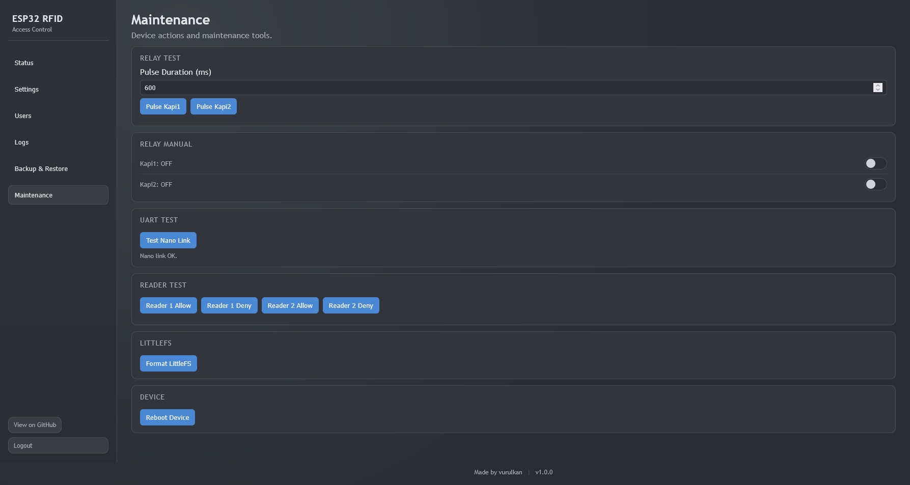
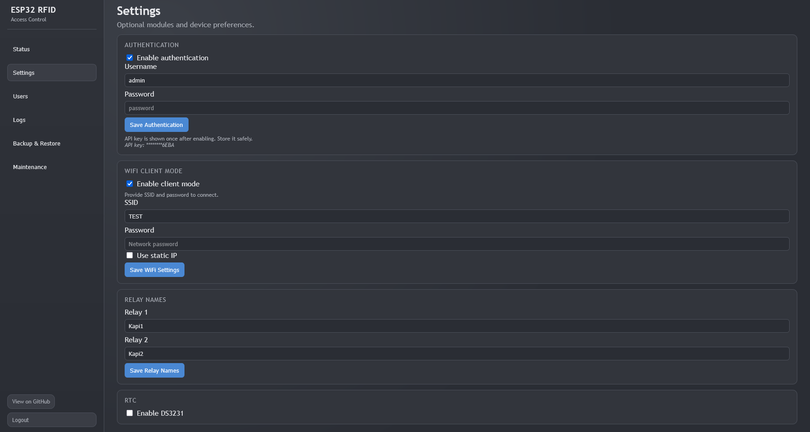
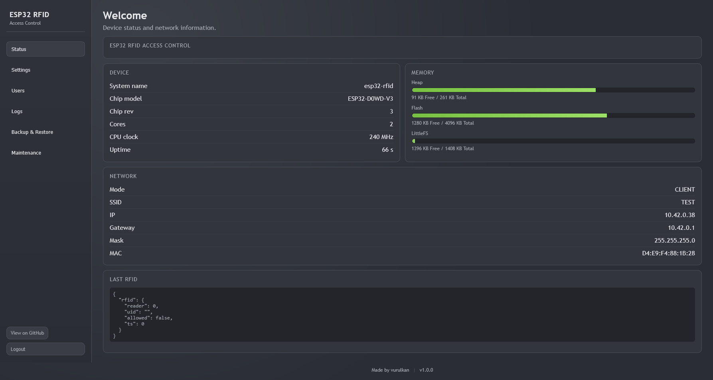
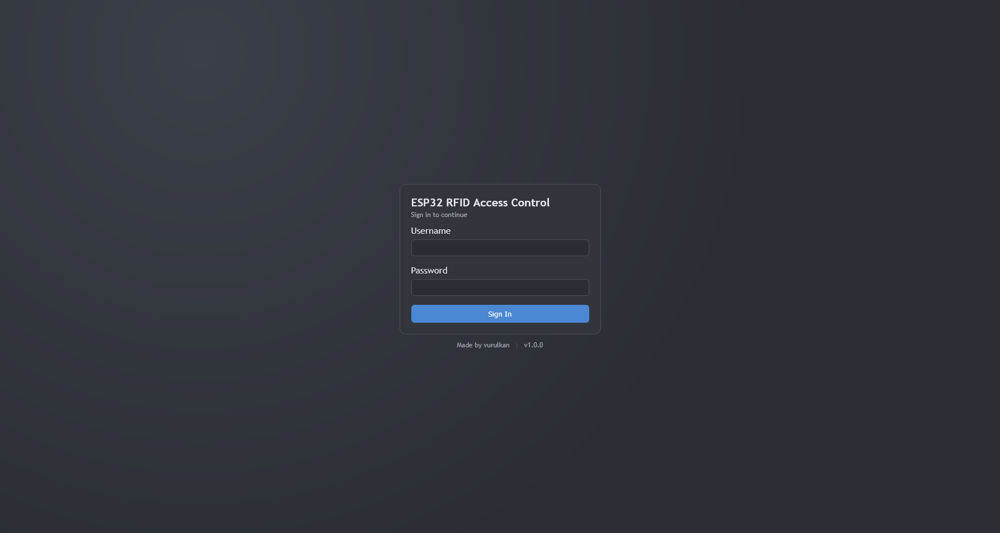
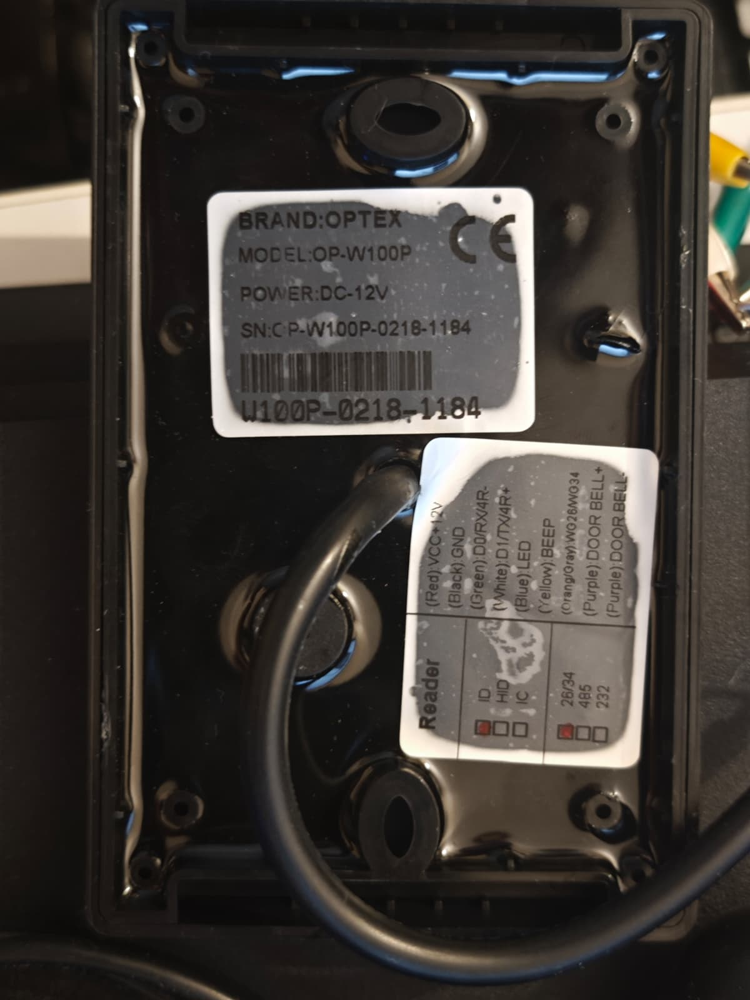
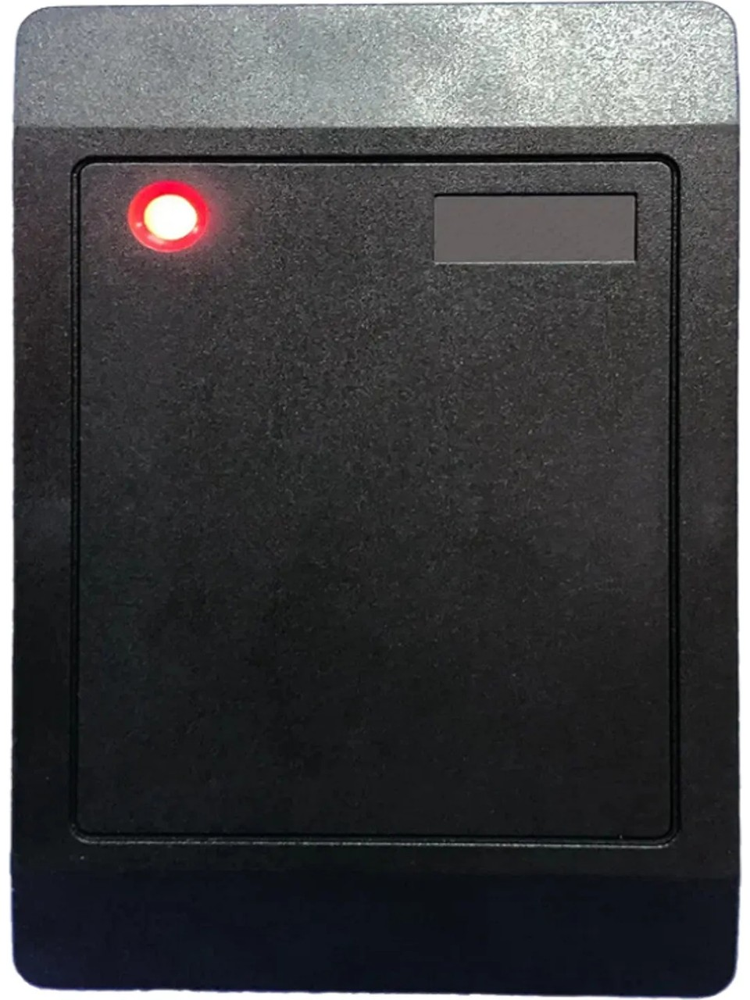

# RFID Access Control (ESP32)

## Screenshots
<p align="center">
  <a href="ss1.png">
    
  </a>
  <a href="ss2.png">
    
  </a>
  <a href="ss3.png">
    
  </a>
  <a href="ss4.png">
    
  </a>
</p>

## Relay Board
<p align="center">
  <a href="board.jpg">
    
  </a>
</p>

## Reader
<p align="center">
  <a href="reader1.jpg">
    
  </a>
  <a href="reader2.jpg">
    
  </a>
</p>

## Overview
- Target: ESP32_Relay X2 Board with ESP32-WROOM-32E (N4)
- Framework: Arduino ESP32 core (2.0.17 tested, 3.3.x compatible)
- Architecture: FreeRTOS tasks + queues, modular components
- Web UI: Embedded gzip assets served via `WebServer`

## Power (ESP32_Relay X2 board)
- Board VCC/GND input accepts DC 5V or 7-30V (board-side terminals, not ESP32 module pins).
- Nano can be powered from the ESP32 board 5V pin.
- Full system can run from a single 12V adapter.

## Requirements
- Arduino IDE with ESP32 core (2.0.17 recommended)
- Optional: DS3231 RTC module
- Arduino Nano (Wiegand bridge, 5V)

## WiFi (AP mode)
- SSID: `RFID-ACCESS`
- Password: `rfid1234`
- Default AP IP: `192.168.4.1`

## WiFi (Client mode)
- Configure SSID/Password in Settings
- Optional static IP (IP/Gateway/Mask)
- IP is shown in Status and printed to Serial after connect

## GPIO / Wiring

### Relay outputs (fixed by board)
- Relay 1: GPIO16
- Relay 2: GPIO17

### Wiegand readers (via Arduino Nano)
| Signal | Nano Pin |
| --- | --- |
| Reader 1 D0 | D2 (interrupt) |
| Reader 1 D1 | D3 (interrupt) |
| Reader 2 D0 | D4 |
| Reader 2 D1 | D5 |
| Reader 1 LED | D6 |
| Reader 1 BEEP | D7 |
| Reader 2 LED | D8 |
| Reader 2 BEEP | D9 |

Nano handles the 5V signals, ESP32 stays at 3.3V.
LED/BEEP lines are active-low (pull to GND to trigger).

### ESP32 <-> Nano UART
- ESP32 RX: GPIO33
- ESP32 TX: GPIO32 (optional, for future control)
- Nano TX (D1) -> ESP32 RX (GPIO33)
- Nano RX (D0) -> ESP32 TX (GPIO32)
- Common GND is required
- ESP32 default RX/TX pins are not used for this link
- Nano D0/D1 are shared with USB-Serial. Disconnect ESP32 UART when flashing or using Serial Monitor.

### DS3231 RTC (optional, I2C)
- SDA: GPIO21
- SCL: GPIO22
- GND: GND
- VCC: 3.3V or 5V (according to your module)

### IO0 (maintenance)
- Actions are decided **when the button is released** (press duration).
- Hold IO0 for 2-5 seconds to reset WiFi settings (AP mode)
- Hold IO0 for 5-10 seconds to disable authentication
- Hold IO0 for 10+ seconds to format LittleFS and reboot

## Tasks
- `wifi_task`: starts AP, updates state flag only in WiFi event callback
- `web_task`: REST API + UI
- `reader_uart_task`: receives Wiegand events from Nano over UART
- `logic_task`: users, logs, relay decisions

## User Management
- Stored in LittleFS (`/users.txt`)
- Survives reboot/power loss
- Max users: 1000

## Log System
- RAM keeps last 50 entries (ring buffer)
- LittleFS keeps up to 10,000 entries (overwrites oldest)
- Persisted to LittleFS (`/logs.txt`)
- Only `granted` and `denied` entries are stored
- When RTC is enabled and set, logs include `DD/MM/YYYY,HH:MM:SS` (as extra columns)
- `logs.txt` uses comma-separated columns:
  - Without RTC: `<ts_ms>,<relay>,<status>,<uid>,<name>`
  - With RTC: `<ts_ms>,<DD/MM/YYYY>,<HH:MM:SS>,<relay>,<status>,<uid>,<name>`
- Clearable via API

## Settings (LittleFS)
- Stored in `/settings.txt`
- RTC default is disabled after format or clean install
- RTC set state is persisted (no need to re-set after reboot)
- WiFi mode and credentials are persisted until format
- Optional static IP for client mode is persisted
- Relay names are persisted (defaults: `Relay 1`, `Relay 2`)
- Relay manual on/off states are persisted
- Authentication settings are persisted (username, password, API key)

## Backup & Restore
- `GET /backup?type=users|settings` returns plain text
- `POST /restore` with plain text body (auto-detects settings/users sections)
- Logs can be downloaded via `/logs/export`

## Build & Upload (Arduino IDE)
1. Install ESP32 core (2.0.17 recommended).
2. Open `src/esp32-rfid` as the sketch folder.
3. Board: `ESP32 Dev Module`, select your port.
4. Upload and open Serial Monitor at 115200.

## Nano Firmware
- Wiegand bridge firmware is in `nano/wiegand_nano/wiegand_nano.ino`.
- UART: 115200 baud, output format `1,UID` or `2,UID` per line.
- Feedback commands from ESP32: `A,<reader>` (allow) or `D,<reader>` (deny).

## First Boot (LittleFS)
- Some new boards may ship with an unformatted LittleFS.
- If you see LittleFS mount errors on first boot, format it via Maintenance -> "Format LittleFS" or hold IO0 for 10+ seconds.

## REST API
- `GET /` UI (gzip)
- `GET /login` Login page (gzip)
- `GET /app.js`, `GET /style.css` (gzip)
- `GET /users`
- `POST /users` (uid, name, relay1, relay2)
- `DELETE /users` (uid)
- `GET /logs`
- `DELETE /logs?scope=ram|all`
- `GET /logs/export`
- `GET /rfid`
- `GET /status`
- `GET /backup?type=users|settings`
- `POST /restore`
- `POST /auth/login`
- `POST /auth/logout`
- `POST /maintenance/format`
- `POST /maintenance/uart-test`
- `POST /maintenance/reader-test` (reader=1|2, action=allow|deny)
- `POST /maintenance/relay` (relay=1|2, action=pulse|on|off, duration_ms=50..10000)
- `POST /maintenance/reboot`

## Maintenance Tests
- Reader test (allow/deny) triggers LED/BEEP feedback for each reader.

## Authentication
- When enabled, the UI shows a login page.
- API requests accept `X-API-Key` or an authenticated session cookie.
- API key is shown **once** when enabling; store it safely.
- Session has a 5-minute inactivity timeout and can be ended via Logout.
- Logout is explicit; browsers cannot reliably distinguish refresh vs close.

## Notes
- Maintenance tasks can be done via UI or IO0 button (2-5s WiFi reset, 5-10s auth disable, 10s+ format).

### Regenerate Web Assets
- If you edit `src/esp32-rfid/web/*`, regenerate `*.gz.h` assets.
  Place `pack_web.py` inside `src/esp32-rfid/web/` and run:
```
python pack_web.py
```

## UART Protocol (Nano -> ESP32)
- One line per card read, terminated by `\\n`
- Format: `1,UID` or `2,UID`
- `UID` should be uppercase hex without spaces (e.g., `D7EE4C06`)

## UART Protocol (ESP32 -> Nano)
- `A,1` or `A,2` -> access granted (LED + beep)
- `D,1` or `D,2` -> access denied (double beep)
- `PING` -> Nano replies with `PONG`
