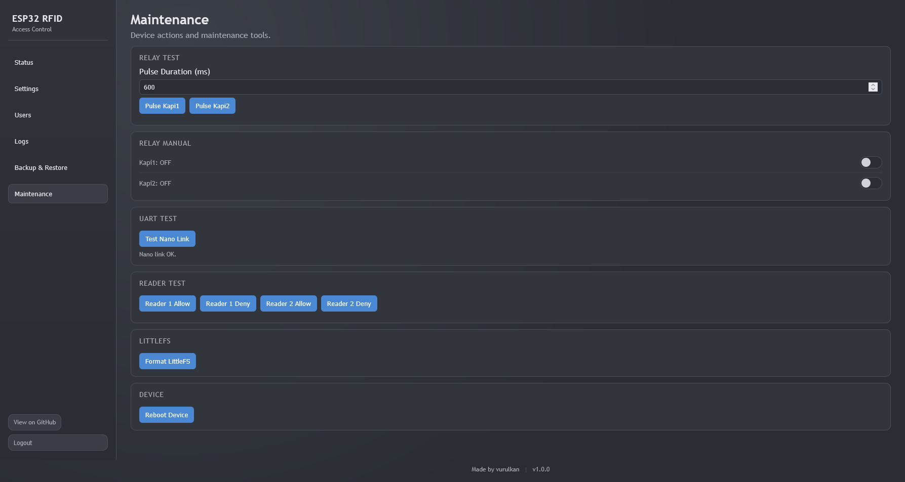
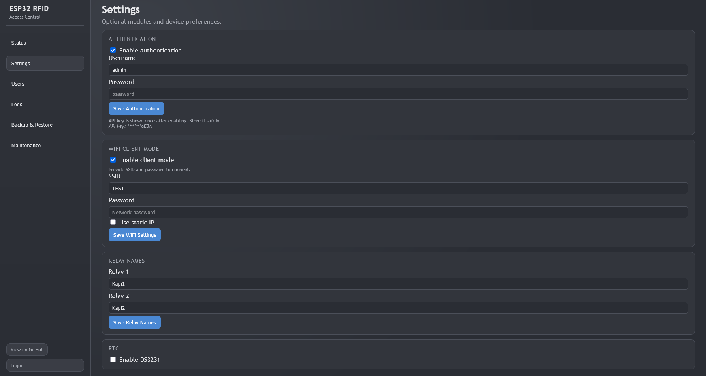
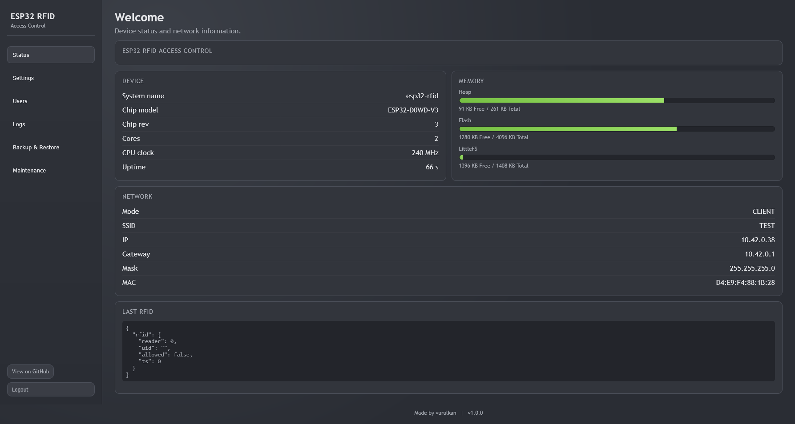
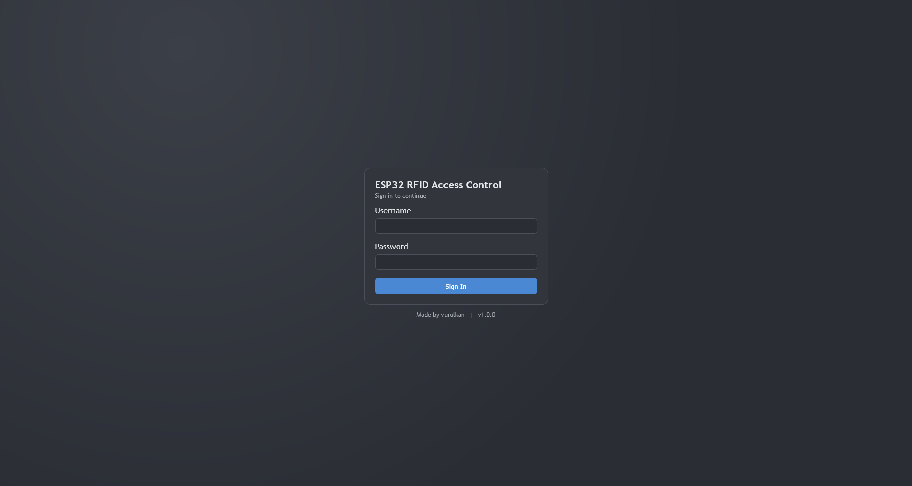
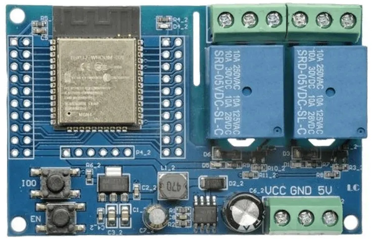
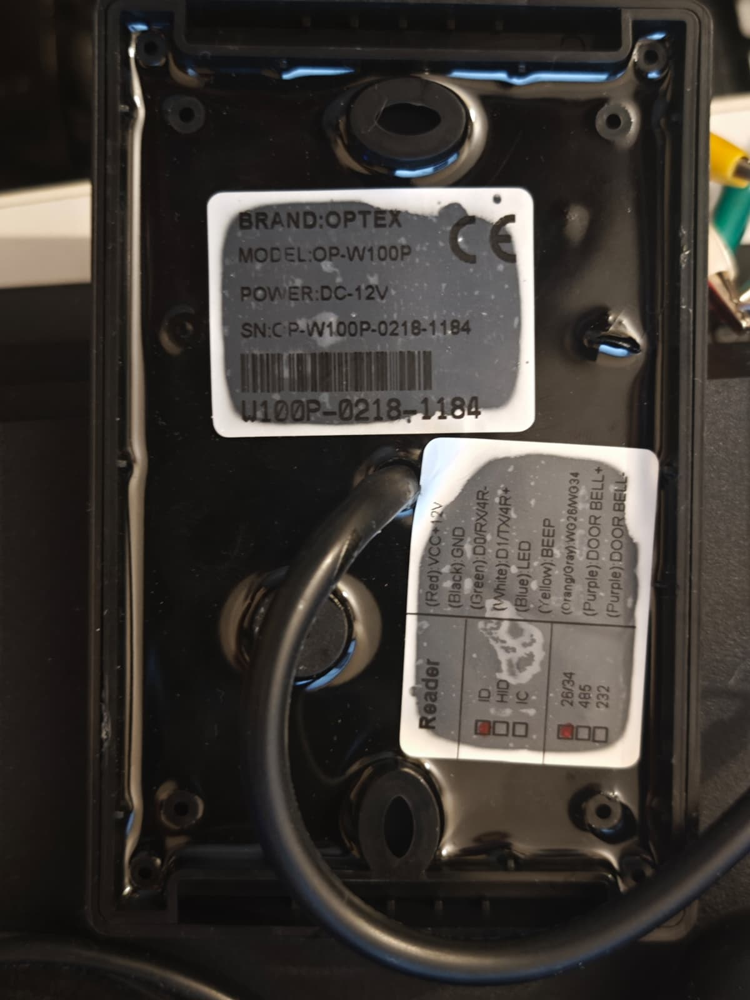
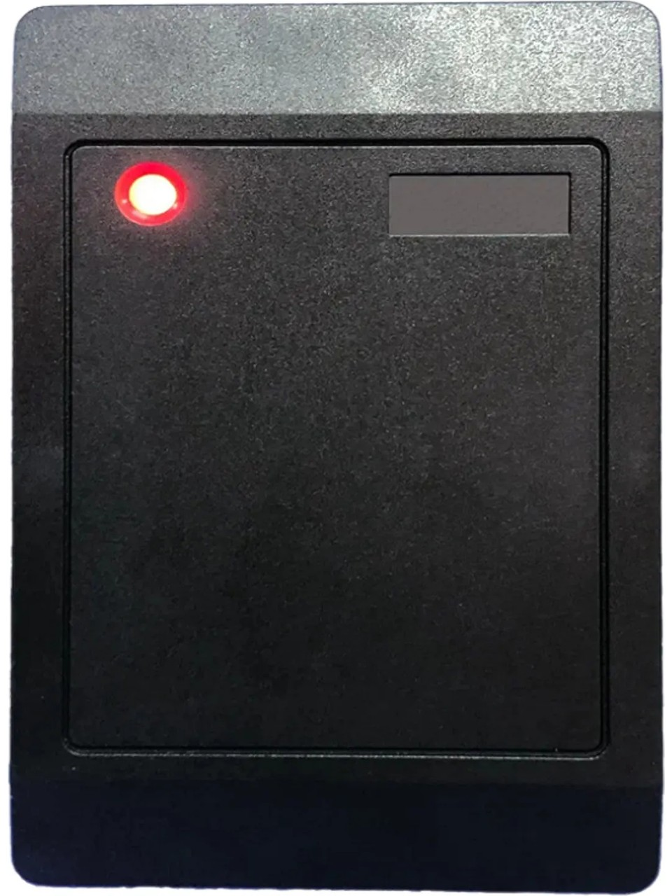

# RFID Access Control (ESP32)

## Screenshots
<p align="center">
  <a href="ss1.png">
    
  </a>
  <a href="ss2.png">
    
  </a>
  <a href="ss3.png">
    
  </a>
  <a href="ss4.png">
    
  </a>
</p>

## Relay Board
<p align="center">
  <a href="board.jpg">
    
  </a>
</p>

## Reader
<p align="center">
  <a href="reader1.jpg">
    
  </a>
  <a href="reader2.jpg">
    
  </a>
</p>

## Overview
- Target: ESP32_Relay X2 Board with ESP32-WROOM-32E (N4)
- Framework: Arduino ESP32 core (2.0.17 tested, 3.3.x compatible)
- Architecture: FreeRTOS tasks + queues, modular components
- Web UI: Embedded gzip assets served via `WebServer`

## Power (ESP32_Relay X2 board)
- Board VCC/GND input accepts DC 5V or 7-30V (board-side terminals, not ESP32 module pins).
- Nano can be powered from the ESP32 board 5V pin.
- Full system can run from a single 12V adapter.

## Requirements
- Arduino IDE with ESP32 core (2.0.17 recommended)
- Optional: DS3231 RTC module
- Arduino Nano (Wiegand bridge, 5V)

## WiFi (AP mode)
- SSID: `RFID-ACCESS`
- Password: `rfid1234`
- Default AP IP: `192.168.4.1`

## WiFi (Client mode)
- Configure SSID/Password in Settings
- Optional static IP (IP/Gateway/Mask)
- IP is shown in Status and printed to Serial after connect

## GPIO / Wiring

### Relay outputs (fixed by board)
- Relay 1: GPIO16
- Relay 2: GPIO17

### Wiegand readers (via Arduino Nano)
| Signal | Nano Pin |
| --- | --- |
| Reader 1 D0 | D2 (interrupt) |
| Reader 1 D1 | D3 (interrupt) |
| Reader 2 D0 | D4 |
| Reader 2 D1 | D5 |
| Reader 1 LED | D6 |
| Reader 1 BEEP | D7 |
| Reader 2 LED | D8 |
| Reader 2 BEEP | D9 |

Nano handles the 5V signals, ESP32 stays at 3.3V.
LED/BEEP lines are active-low (pull to GND to trigger).

### ESP32 <-> Nano UART
- ESP32 RX: GPIO33
- ESP32 TX: GPIO32 (optional, for future control)
- Nano TX (D1) -> ESP32 RX (GPIO33)
- Nano RX (D0) -> ESP32 TX (GPIO32)
- Common GND is required
- ESP32 default RX/TX pins are not used for this link
- Nano D0/D1 are shared with USB-Serial. Disconnect ESP32 UART when flashing or using Serial Monitor.

### DS3231 RTC (optional, I2C)
- SDA: GPIO21
- SCL: GPIO22
- GND: GND
- VCC: 3.3V or 5V (according to your module)

### IO0 (maintenance)
- Actions are decided **when the button is released** (press duration).
- Hold IO0 for 2-5 seconds to reset WiFi settings (AP mode)
- Hold IO0 for 5-10 seconds to disable authentication
- Hold IO0 for 10+ seconds to format LittleFS and reboot

## Tasks
- `wifi_task`: starts AP, updates state flag only in WiFi event callback
- `web_task`: REST API + UI
- `reader_uart_task`: receives Wiegand events from Nano over UART
- `logic_task`: users, logs, relay decisions

## User Management
- Stored in LittleFS (`/users.txt`)
- Survives reboot/power loss
- Max users: 1000

## Log System
- RAM keeps last 50 entries (ring buffer)
- LittleFS keeps up to 10,000 entries (overwrites oldest)
- Persisted to LittleFS (`/logs.txt`)
- Only `granted` and `denied` entries are stored
- When RTC is enabled and set, logs include `DD/MM/YYYY,HH:MM:SS` (as extra columns)
- `logs.txt` uses comma-separated columns:
  - Without RTC: `<ts_ms>,<relay>,<status>,<uid>,<name>`
  - With RTC: `<ts_ms>,<DD/MM/YYYY>,<HH:MM:SS>,<relay>,<status>,<uid>,<name>`
- Clearable via API

## Settings (LittleFS)
- Stored in `/settings.txt`
- RTC default is disabled after format or clean install
- RTC set state is persisted (no need to re-set after reboot)
- WiFi mode and credentials are persisted until format
- Optional static IP for client mode is persisted
- Relay names are persisted (defaults: `Relay 1`, `Relay 2`)
- Relay manual on/off states are persisted
- Authentication settings are persisted (username, password, API key)

## Backup & Restore
- `GET /backup?type=users|settings` returns plain text
- `POST /restore` with plain text body (auto-detects settings/users sections)
- Logs can be downloaded via `/logs/export`

## Configurable Constants

These values can be changed before compiling:

| Constant | File | Default | Description |
| --- | --- | --- | --- |
| `kRelayPulseMs` | `src/esp32-rfid/logic.cpp` | `600` | Relay activation duration on card read (ms) |
| `kMaxFileLogs` | `src/esp32-rfid/log.cpp` | `10000` | Maximum log entries stored in LittleFS |

**Example — change relay pulse to 1 second:**
```cpp
// logic.cpp
constexpr uint32_t kRelayPulseMs = 1000;
```

**Example — increase log limit to 50,000:**
```cpp
// log.cpp
constexpr size_t kMaxFileLogs = 50000;
```

Recompile and upload after any change.

## Build & Upload (Arduino IDE)
1. Install ESP32 core (2.0.17 recommended).
2. Open `src/esp32-rfid` as the sketch folder.
3. Board: `ESP32 Dev Module`, select your port.
4. **Tools → Partition Scheme → Default 4MB with spiffs** (required for OTA support).
5. Upload and open Serial Monitor at 115200.

## Exporting Firmware Binary (for OTA)

To get a `.bin` file for web-based OTA update:

**Sketch → Export Compiled Binary** (`Ctrl + Alt + S`)

Arduino IDE compiles and places the output in the sketch's `build/` folder:

```
src/esp32-rfid/
└── build/
    └── esp32.esp32.esp32/
        ├── esp32-rfid.ino.bin           ← upload this via web UI
        ├── esp32-rfid.ino.bootloader.bin
        └── esp32-rfid.ino.partitions.bin
```

Only `esp32-rfid.ino.bin` is needed for OTA. The bootloader and partition files are not required.

## Nano Firmware
- Wiegand bridge firmware is in `nano/wiegand_nano/wiegand_nano.ino`.
- UART: 115200 baud, output format `1,UID` or `2,UID` per line.
- Feedback commands from ESP32: `A,<reader>` (allow) or `D,<reader>` (deny).

## First Boot (LittleFS)
- Some new boards may ship with an unformatted LittleFS.
- If you see LittleFS mount errors on first boot, format it via Maintenance -> "Format LittleFS" or hold IO0 for 10+ seconds.

## REST API

Base URL: `http://192.168.4.1` (AP mode default). Replace with your static/DHCP IP in client mode.

When authentication is enabled, add `-H "X-API-Key: YOUR_KEY"` to every request, or use a session cookie obtained from `/auth/login`.

---

### Users

#### List users
Paginated — 50 users per page by default.

| Parameter | Default | Description |
| --- | --- | --- |
| `offset` | `0` | Skip N users |
| `limit` | `50` | Results per page (max 100) |

```bash
# First page
curl "http://192.168.4.1/users"

# Second page (e.g. 200 users total)
curl "http://192.168.4.1/users?offset=50&limit=50"

# With API key
curl -H "X-API-Key: YOUR_KEY" "http://192.168.4.1/users?offset=0&limit=50"
```

Response:
```json
{"users":[{"uid":"D7EE4C06","name":"Ali","relay1":true,"relay2":false}],"total":200,"offset":0,"limit":50}
```

#### Add user
```bash
curl -X POST "http://192.168.4.1/users" \
  -d "uid=D7EE4C06&name=Ali&relay1=1&relay2=0"
```

#### Delete user
```bash
curl -X DELETE "http://192.168.4.1/users?uid=D7EE4C06"
```

---

### Logs

#### List recent logs (RAM, last 50)
```bash
curl "http://192.168.4.1/logs"
```

#### Clear RAM logs
```bash
curl -X DELETE "http://192.168.4.1/logs?scope=ram"
```

#### Clear all logs (RAM + LittleFS)
```bash
curl -X DELETE "http://192.168.4.1/logs?scope=all"
```

#### Download full log file
```bash
curl "http://192.168.4.1/logs/export" -o logs.txt
```

---

### RFID

#### Get last scanned card
```bash
curl "http://192.168.4.1/rfid"
```

Response:
```json
{"rfid":{"reader":1,"uid":"D7EE4C06","allowed":true,"ts":12345}}
```

---

### Status
```bash
curl "http://192.168.4.1/status"
```

---

### Settings

#### Get settings
```bash
curl "http://192.168.4.1/settings"
```

#### Set WiFi client mode
```bash
curl -X POST "http://192.168.4.1/settings" \
  -d "wifi_client=1&wifi_ssid=MyNetwork&wifi_pass=MyPassword"
```

#### Set static IP
```bash
curl -X POST "http://192.168.4.1/settings" \
  -d "wifi_static=1&wifi_ip=192.168.1.50&wifi_gateway=192.168.1.1&wifi_mask=255.255.255.0"
```

#### Set relay names
```bash
curl -X POST "http://192.168.4.1/settings" \
  -d "relay1=KapiA&relay2=KapiB"
```

#### Enable authentication
```bash
curl -X POST "http://192.168.4.1/settings" \
  -d "auth_enabled=1&auth_user=admin&auth_pass=secret"
```

Response includes `api_key` (shown once — save it):
```json
{"ok":true,"api_key":"3F9A..."}
```

---

### Authentication

#### Login (returns session cookie)
```bash
curl -c cookies.txt -X POST "http://192.168.4.1/auth/login" \
  -d "user=admin&pass=secret"
```

#### Use session cookie for subsequent requests
```bash
curl -b cookies.txt "http://192.168.4.1/users"
```

#### Logout
```bash
curl -b cookies.txt -X POST "http://192.168.4.1/auth/logout"
```

---

### Backup & Restore

#### Download user backup
```bash
curl "http://192.168.4.1/backup?type=users" -o backup-users.txt
```

#### Download settings backup
```bash
curl "http://192.168.4.1/backup?type=settings" -o backup-settings.txt
```

#### Download full backup (users + settings)
```bash
curl "http://192.168.4.1/backup?type=full" -o backup-full.txt
```

#### Restore from backup file
```bash
curl -X POST "http://192.168.4.1/restore" \
  -H "Content-Type: text/plain" \
  --data-binary @backup-full.txt
```

---

### RTC

#### Read current RTC time
```bash
curl "http://192.168.4.1/rtc"
```

#### Set RTC time
```bash
curl -X POST "http://192.168.4.1/rtc" \
  -d "datetime=2025-05-10T14:30:00"
```

---

### Maintenance

#### Pulse relay (momentary activation)
```bash
# Relay 1, default duration (600 ms)
curl -X POST "http://192.168.4.1/maintenance/relay" \
  -d "relay=1&action=pulse"

# Relay 2, custom duration
curl -X POST "http://192.168.4.1/maintenance/relay" \
  -d "relay=2&action=pulse&duration_ms=1000"
```

#### Set relay state (manual on/off)
```bash
curl -X POST "http://192.168.4.1/maintenance/relay" \
  -d "relay=1&action=on"

curl -X POST "http://192.168.4.1/maintenance/relay" \
  -d "relay=1&action=off"
```

#### UART link test (ESP32 <-> Nano ping)
```bash
curl -X POST "http://192.168.4.1/maintenance/uart-test"
```

#### Reader feedback test (LED + beep)
```bash
# Allow signal on reader 1
curl -X POST "http://192.168.4.1/maintenance/reader-test" \
  -d "reader=1&action=allow"

# Deny signal on reader 2
curl -X POST "http://192.168.4.1/maintenance/reader-test" \
  -d "reader=2&action=deny"
```

#### Format LittleFS (erases all data)
```bash
curl -X POST "http://192.168.4.1/maintenance/format"
```

#### Reboot device
```bash
curl -X POST "http://192.168.4.1/maintenance/reboot"
```

---

### Firmware Update (OTA)

Upload a new firmware binary. Device reboots automatically after a successful update.

> **Requires OTA-compatible partition scheme** (e.g. Default 4MB with SPIFFS/LittleFS).
> Select via Arduino IDE: **Tools → Partition Scheme → Default 4MB with spiffs**.

```bash
curl -X POST "http://192.168.4.1/firmware" \
  -H "X-API-Key: YOUR_KEY" \
  -F "firmware=@esp32-rfid.ino.bin"
```

Response on success (device reboots immediately after):
```json
{"ok":true}
```

## Maintenance Tests
- Reader test (allow/deny) triggers LED/BEEP feedback for each reader.

## Authentication
- When enabled, the UI shows a login page.
- API requests accept `X-API-Key` or an authenticated session cookie.
- API key is shown **once** when enabling; store it safely.
- Session has a 5-minute inactivity timeout and can be ended via Logout.
- Logout is explicit; browsers cannot reliably distinguish refresh vs close.

## Notes
- Maintenance tasks can be done via UI or IO0 button (2-5s WiFi reset, 5-10s auth disable, 10s+ format).

### Regenerate Web Assets
- If you edit `src/esp32-rfid/web/*`, regenerate `*.gz.h` assets. Run `pack_web.py` from `src/esp32-rfid/web/`:
```
python pack_web.py
```

## UART Protocol (Nano -> ESP32)
- One line per card read, terminated by `\\n`
- Format: `1,UID` or `2,UID`
- `UID` should be uppercase hex without spaces (e.g., `D7EE4C06`)

## UART Protocol (ESP32 -> Nano)
- `A,1` or `A,2` -> access granted (LED + beep)
- `D,1` or `D,2` -> access denied (double beep)
- `PING` -> Nano replies with `PONG`
